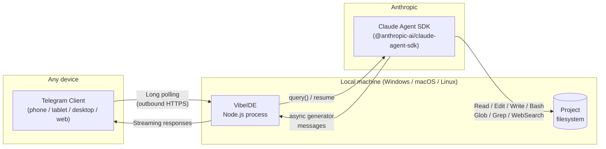
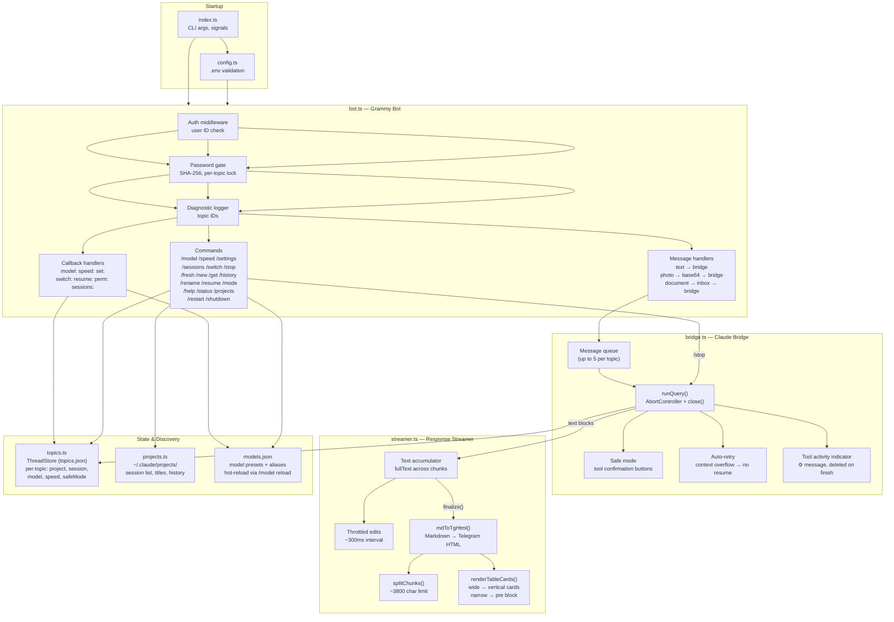
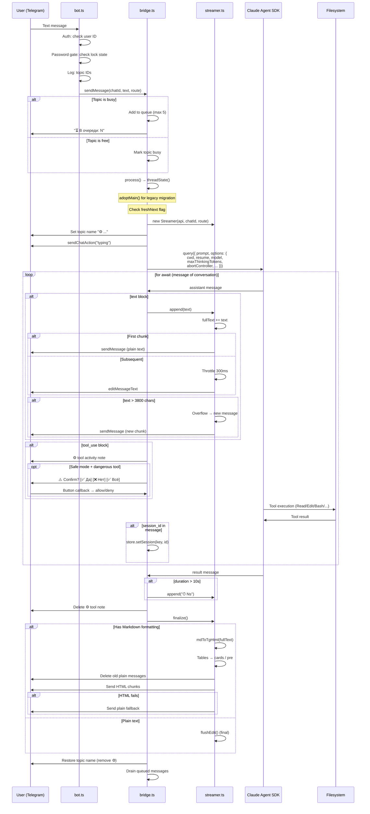
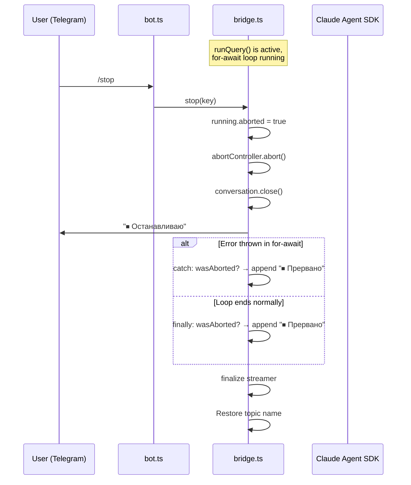
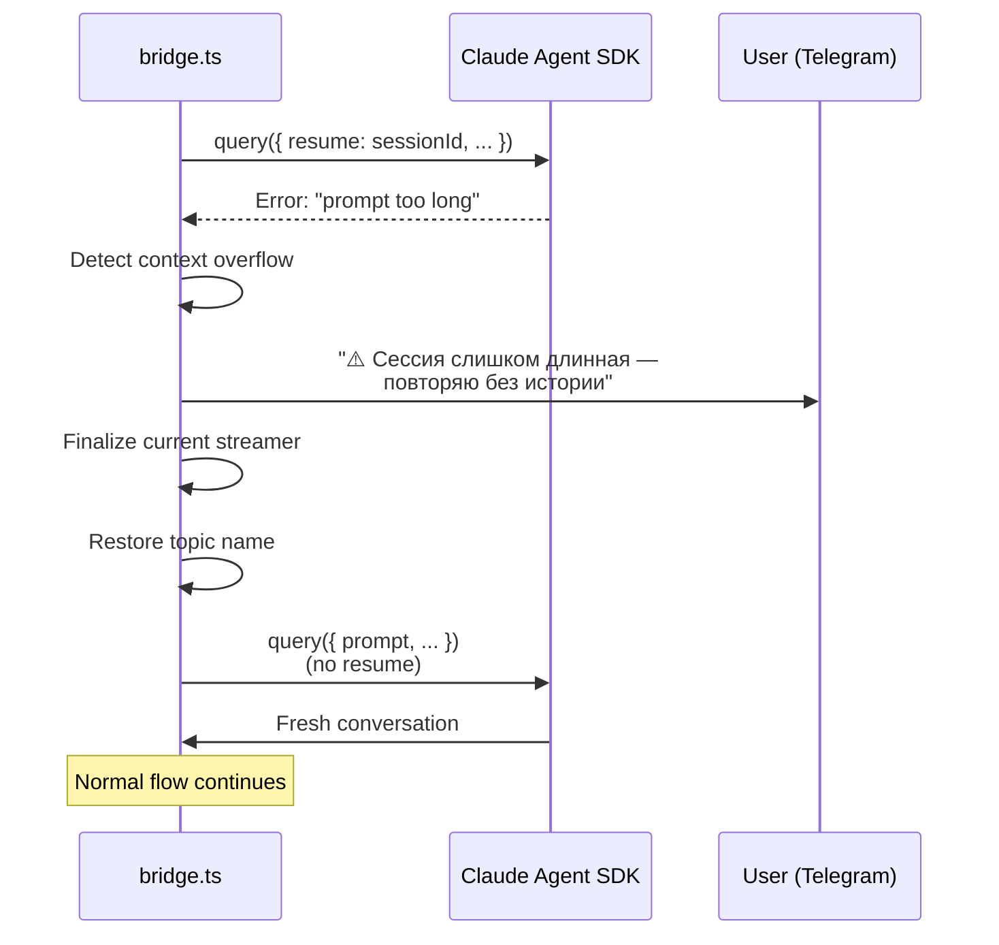
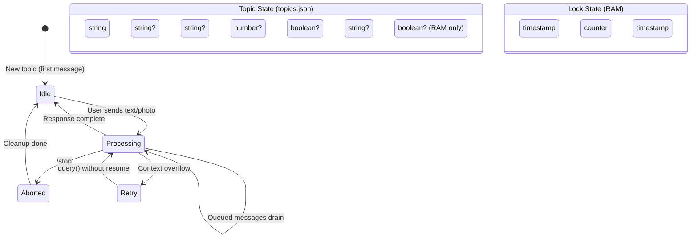

# VibeIDE — Block Diagrams

Three levels of detail: high-level overview, component structure, and message processing flow.

## Level 1 — High-Level Architecture

**Key properties:**
- Single local process, zero infrastructure
- No inbound ports — Grammy uses long polling (outbound HTTPS only)
- Claude operates on the real filesystem with full tool access
- Session resume: start a conversation in VS Code, continue on phone

---

## Level 2 — Component Structure

---

## Level 3 — Message Processing Flow

### /stop Abort Flow

### Context Overflow Auto-Retry

---

## Level 2b — Per-Topic State Model

---

## Data Files

| File | Location | Purpose | Persistence |
|------|----------|---------|-------------|
| `topics.json` | repo root | Per-topic state: project, session, model, speed, mode | Disk (JSON) |
| `models.json` | repo root | Model presets + aliases, hot-reloadable | Disk (JSON) |
| `.env` | repo root | Bot token, user ID, password hash | Disk (gitignored) |
| `~/.claude/projects/` | Home dir | Session .jsonl files, titles | Claude Code managed |
| `inbox/` | CWD | Files sent by user via Telegram | Disk |
| `restart.json` | CWD | Restart confirmation flag | Temp (deleted on read) |
